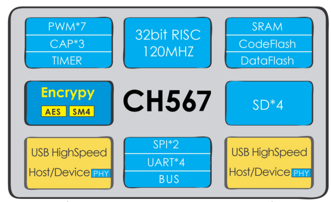

# [CH567](https://github.com/sochub/CH567)

 

#### [Vendor](https://github.com/sochub/Vendor)：[WCH](https://github.com/sochub/WCH)
#### [Cortex](https://github.com/sochub/Cortex)：[ARM9](https://github.com/sochub/ARM)
#### [Level](https://github.com/sochub/Level)：96/120MHz 

## [CH567描述](https://github.com/sochub/CH567/wiki) 

[CH567](https://github.com/sochub/CH567) 是一款高性能32位精简指令集微控制器，系统主频可达120MHZ。片上集成两组独立的高速USB2.0主/从控制器、4组SDIO控制器、加解密算法模块、4组串口、7路PWM、3组定时器等丰富的外设资源，LQFP48封装可广泛应用于各种嵌入式设备。

 

封装：LQFP48

### [资源收录](https://github.com/sochub/CH567)

- [文档](docs/)
- [资源](src/)

### [选型建议](https://github.com/sochub)

[CH567](https://github.com/sochub/CH567)定位小众的HUB类产品，拥有4组SDIO接口，可用于相关领域，升级替换方案[CH568](https://github.com/sochub/CH5678) 

###  [SoC开发平台](http://www.qitas.cn)   
