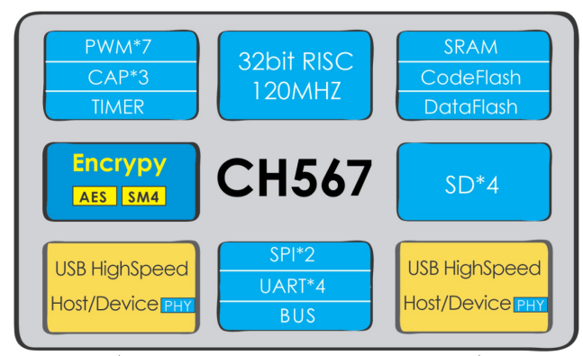

# [CH567](https://github.com/sochub/CH567)

 
####  qitas@qitas.cn
#### 父级：[WCH](https://github.com/sochub/WCH) 
#### 归属：[RISC](https://github.com/sochub/RISC) 

## [描述](https://github.com/sochub/CH567/wiki) 

CH567是一款高性能32位精简指令集微控制器，系统主频可达120MHZ。片上集成两组独立的高速USB2.0主/从控制器、4组SDIO控制器、加解密算法模块、4组串口、7路PWM、3组定时器等丰富的外设资源，LQFP48封装可广泛应用于各种嵌入式设备。

 

### [资源收录](https://github.com/sochub/CH567)

- [文档](docs/)
- [资源](src/)
- [工程](project/)

### [替代方案](https://github.com/sochub/CH567)

- [CH568](https://github.com/sochub/CH5678) 
- [CH566](https://github.com/sochub/CH5676) 

###  [SoC开发平台](http://www.qitas.cn)   
