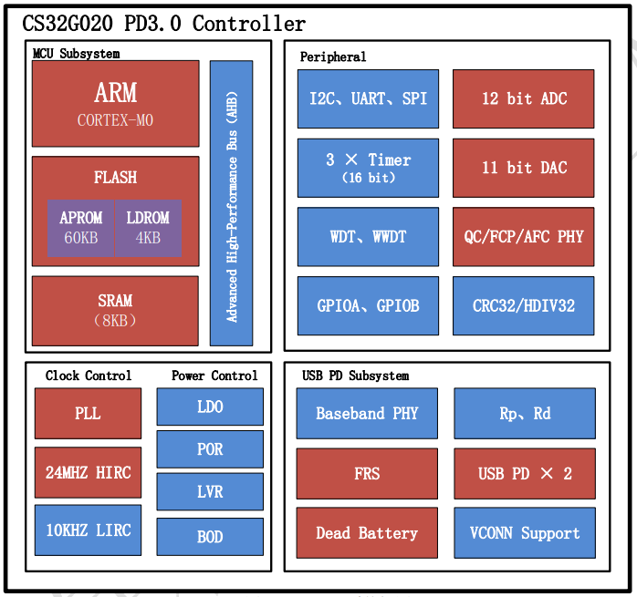

# [CS32G020](https://github.com/SoCXin/CS32G020)

#### [Vendor](https://github.com/SoCXin/Vendor) ：[chipsea](http://www.chipsea.com)
#### [Core](https://github.com/SoCXin/Cortex)：[Cortex M0](https://github.com/SoCXin/CM0)
#### [Level](https://github.com/SoCXin/Level) ：48 MHz * 0.95 DMIPS/MHz

## [简介](https://github.com/SoCXin/CS32G020/wiki)

[CS32G020](https://github.com/SoCXin/CS32G020)系列是芯海科技推出的支持USB Type-C和PD3.0协议的USB-C控制器，可应用于PC电源适配器、手机充电器、移动电源、车充、HUB等领域。CS32G020内嵌ARM® Cortex™-M0内核，主频最高48MHz，因而可以支持很广范围的工业控制和需要高性能CPU的场合。内置64K字节程序flash，数据flash大小可配置(与程序flash共享) ,4K字节LDROM，8K字节SRAM。CS32G020封装包括QFN24和QFN32。

* 60K Flash 内存用来存放应用程序 (APROM)
* 可配置的数据 flash(Data Flash)
* 4KB启动代码空间 (LDROM)
* 内嵌8KB SRAM

#### 关键特性

* USB PD3.0
* 支持QC4.0+、SCP、FCP、AFC协议
* CC口支持21V耐压
* 12位模数转换器(ADC)
* 11位数模转换器(DAC)

### [资源收录](https://github.com/SoCXin/CS32G020)

* [参考文档](docs/)
* [参考资源](src/)
* [参考工程](project/)

### [选型建议](https://github.com/SoCXin)

[CS32G020](https://github.com/SoCXin/CS32G020)

###  [www.SoC.xin(芯)](http://www.SoC.Xin)
